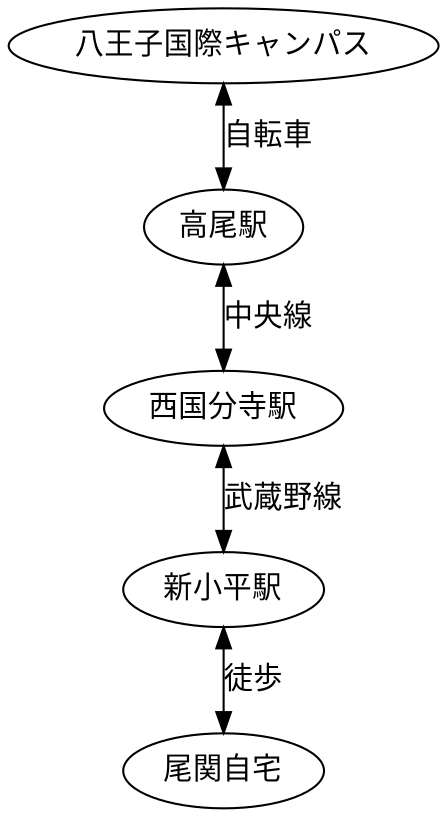

# 尾関の通学経路

[メンバー表に戻る](member.md#メンバー表)

```graphviz
digraph {
    edge [dir=both]
    
    八王子国際キャンパス -> 高尾駅 [label=自転車]
    高尾駅 -> 西国分寺駅 [label=中央線]
    西国分寺駅 -> 新小平駅 [label=武蔵野線]
    新小平駅 -> 尾関自宅 [label=徒歩]
}
```
